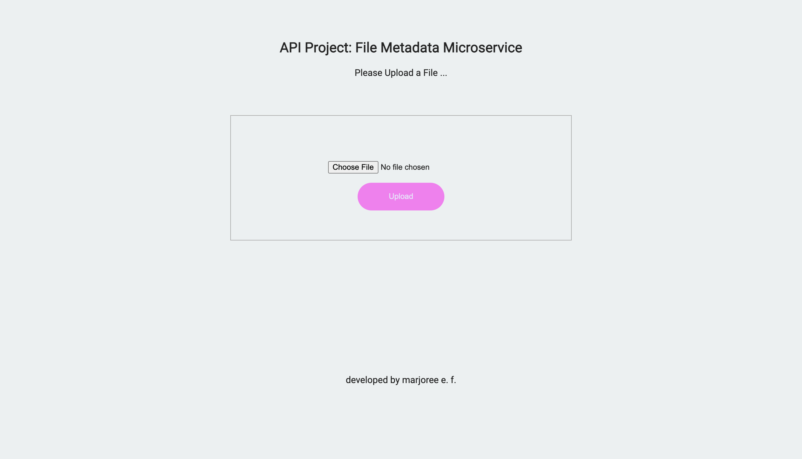

# [File Metadata Microservice](https://www.freecodecamp.org/learn/back-end-development-and-apis/back-end-development-and-apis-projects/file-metadata-microservice)
Challenge by freeCodeCamp intended to demonstrate backend knowledge on serving various types of data. Primarily developed using JavaScript.

## Table of contents

- [Overview](#overview)
  - [The challenge](#the-challenge)
  - [Screenshot](#screenshot)
  - [Links](#links)
- [My process](#my-process)
  - [Built with](#built-with)
  - [What I learned](#what-i-learned)
  - [Continued development](#continued-development)
  - [Useful resources](#useful-resources)
- [Author](#author)
- [Acknowledgments](#acknowledgments)

## Overview
Build a full stack JavaScript app that is functionally similar to this:  [Example](https://file-metadata-microservice.freecodecamp.rocks/). Working on this project will involve you writing your code using one of the following methods:

-Clone this GitHub repo and complete your project locally.
-Use our Replit starter project to complete your project.
-Use a site builder of your choice to complete the project. Be sure to incorporate all the files from our GitHub repo.

### The challenge

Users should be able to:

- submit a form that includes a file upload.
- submit a file and receive the file name, type, and size in bytes within the JSON response.
- The form file input field has the name attribute set to upfile.

### Screenshot


<!-- Result 1
 -->

### Links

- [Solution URL](https://github.com/mfargas/filemetadata-project.git)
- [Live Site URL](https://margie-file-metadata-proj.herokuapp.com/)

## My process

### Built with

- Semantic HTML5 markup
- CSS custom properties
- JavaScript with a Backend Approach
- Multer Middleware using Express.js
- [Node.js](https://nodejs.org/en/) - JS Runtime
- [Express.js](http://expressjs.com/) - Node.js Framework


### What I learned
I learned about Multer which is a node.js middleware for handling multipart/form-data--primarily used for uploading files.

```
const multer = require('multer')
const upload = multer({ dest: 'uploads/' })

app.get('/', function (req, res) {
    res.sendFile(process.cwd() + '/views/index.html');
});

app.post('/api/fileanalyse', upload.single('upfile'), (req, res) => {
  res.json({
    "name": req.file.originalname,
    "type": req.file.mimetype,
    "size": req.file.size
  })
})
```

### Continued development
### Useful resources
- [Multer Middleware](http://expressjs.com/en/resources/middleware/multer.html) -

## Author

- Website - [Marjoree E.F.](https://www.marjoree.com)
- Frontend Mentor - [@mfargas](https://www.frontendmentor.io/profile/mfargas)
- FreeCodeCamp - [@marjoreef](https://www.freecodecamp.org/marjoreef)
- Twitter - [@marjoree_js](https://www.twitter.com/yourusername)

<!-- ## Acknowledgments -->